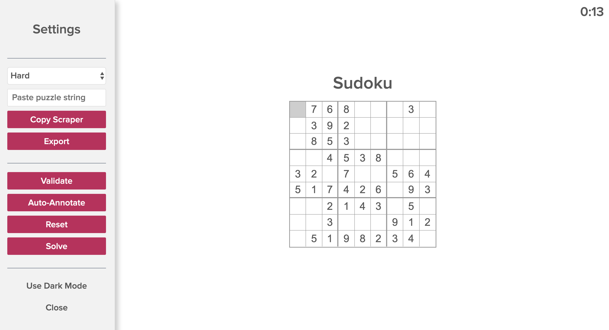

Sudoku
=========

Personal Sudoku client with annotations, puzzle import/export, auto-annotate, validation, and auto-solve capabilities. [Try it now](http://htmlpreview.github.io/?https://github.com/k39chen/Sudoku/blob/master/index.html)!

Controls
---------
- `Arrow keys` to navigate
- `[1-9]` to input number
- `Shift+[1-9]` to input annotated number
- `Cap Locks` to toggle annotation mode
- `Ctrl+Z` to undo previous input
- `Ctrl+Y` to redo input
- `Ctrl+P` toggle pause/resume
- `Ctrl+V` to validate current solution
- `Ctrl+R` to reset current solution
- `Ctrl+[1-9]` to toggle highlight of all instances of the requested number (including annotation)
- `Ctrl+,` toggle settings pane
